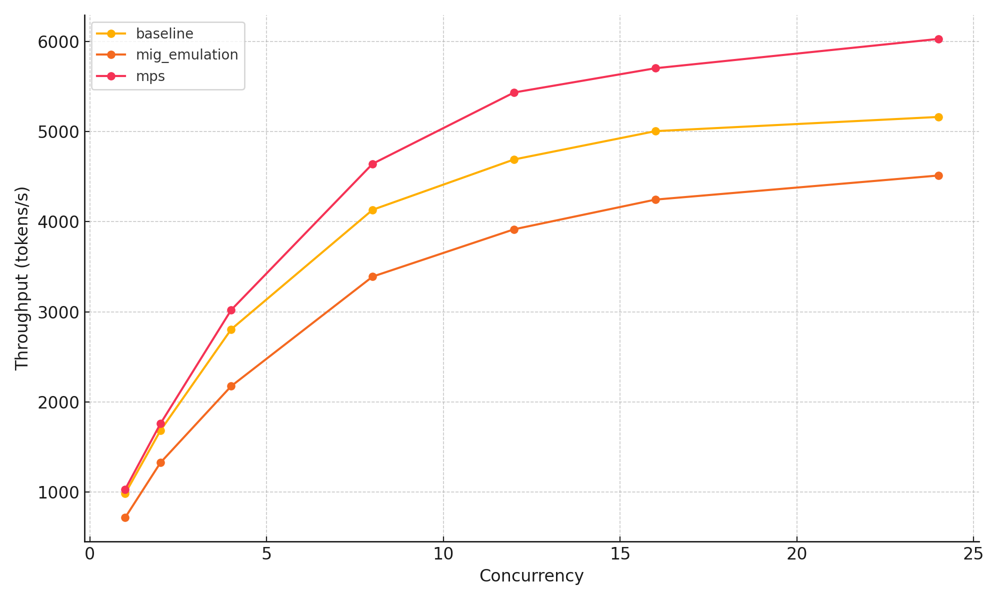
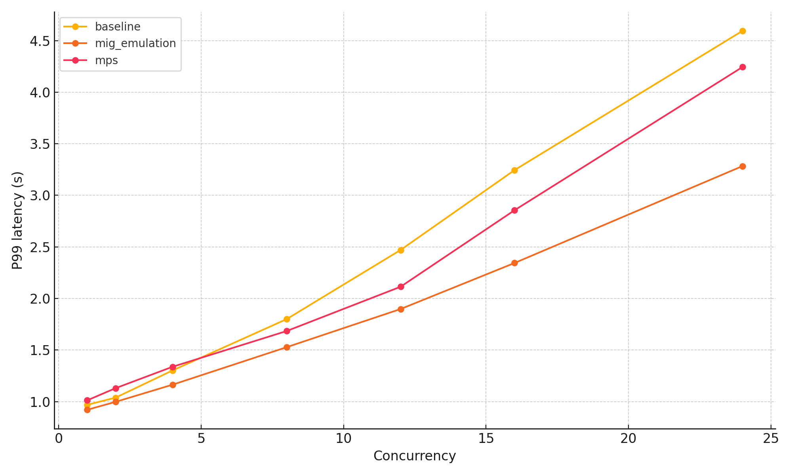

# GPU Sharing for LLM Serving: Survey + Mini-Benchmarks (MPS and MIG-like emulation)

## A description of the project

Features:
- **Serve an LLM** via vLLM’s OpenAI-compatible API server.
- **Generate load** (async HTTP) and measure throughput (tokens/s) and tail latency (P50/P95/P99).
- **Baseline vs CUDA MPS**: toggle MPS around runs.
- **MIG-like emulation** for non-MIG GPUs by launching multiple servers and capping their memory footprint and (optionally) compute share via MPS.
- **GPU monitoring** (best-effort) via NVML to `gpu.csv` for each run.

> Note on MIG: true MIG requires a MIG-capable GPU. If the GPU does not support MIG, the repo provides a *MIG-like emulation* using per-server resource caps. This is not hardware isolation.

## An outline of the code repository

- `src/gpushare/` core Python package
  - `servers.py` launches a vLLM OpenAI server
  - `loadgen.py` async load generator producing P50/P95/P99 and throughput
  - `mps.py` starts/stops CUDA MPS
  - `monitor.py` NVML GPU sampler to CSV (no-op if NVML is unavailable)
  - `runner.py` orchestration for baseline / MPS / MIG-like scenarios
- `configs/` YAML configs for common scenarios
- `scripts/` convenience scripts (run matrix, analyze results)
- `report/` IEEE-style LaTeX report source + figures
- `runs/` local experiment tracking output directory

### Environment Setup

**Option A: pip (recommended)**

```bash
python -m venv .venv
source .venv/bin/activate
pip install -U pip
pip install -e .
# If running on a GPU machine with vLLM + CUDA deps:
# pip install -e '.[cuda]'
```

### Running Experiments

You can run individual experiments using the `gpushare` CLI or use scripts to run a matrix of experiments.

**1. Run Baseline (single tenant, no MPS)**

```bash
gpushare run --config configs/baseline.yaml --concurrency 8 --n-requests 200
```

**2. Run MPS (single server, MPS on)**

```bash
gpushare run --config configs/mps.yaml --concurrency 8 --n-requests 200
```

**3. Run MIG-like emulation (multiple servers on one GPU)**

```bash
gpushare run --config configs/mig_emulation.yaml --concurrency 8 --n-requests 200
```
This launches two vLLM servers on ports `8000` and `8001` and splits the load between them.

**4. Run a Matrix of Experiments**

To reproduce a larger set of results covering multiple concurrencies:

```bash
python scripts/run_matrix.py --model mistralai/Mistral-7B-Instruct-v0.2 --concurrency 1 2 4 8 12 16
```

**5. Analyze Results**

After collecting runs, you can generate plots and summary tables:

```bash
python scripts/analyze_results.py --runs runs --out runs/plots
```

## Results 

### Observations

Efficiency and isolation trade-offs were observed across the different sharing modes:

1.  **Throughput vs. Concurrency**: Generally, throughput increases with concurrency as batching opportunities improve, eventually saturating when the GPU becomes the limiting resource.
2.  **MPS Effect**: MPS (Multi-Process Service) improved throughput in some scenarios by allowing better multi-process overlap and reducing idle gaps. However, under heavy contention, it can amplify contention, leading to increased tail latency compared to a single-tenant baseline.
3.  **MIG-like Emulation**: When true MIG is unavailable, the emulation (constraining memory/compute per server) reduces peak throughput due to subdivided resources. However, it can potentially improve isolation between tenants by strictly limiting each server's footprint, though it lacks true hardware isolation.

### Summary Table

| Scenario | Concurrency | Throughput (tokens/s) | P99 latency (s) |
|---|---|---|---|
| baseline | 8 | 4169 | 1.72 |
| mig_emulation | 8 | 3406 | 1.57 |
| mps | 8 | 4622 | 1.68 |
| baseline | 16 | 5008 | 3.17 |
| mig_emulation | 16 | 4265 | 2.31 |
| mps | 16 | 5789 | 2.77 |
| baseline | 24 | 5168 | 4.60 |
| mig_emulation | 24 | 4536 | 3.22 |
| mps | 24 | 6018 | 4.22 |

### Charts

**Throughput Scaling**


**Tail Latency (P99)**

